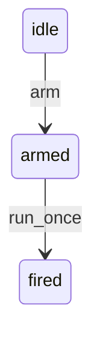
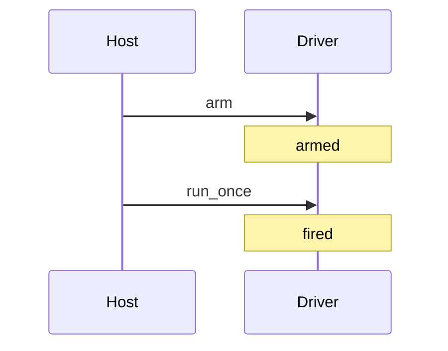

# Driver timer fire (state_tcas Observation)

```mermaid
stateDiagram-v2
    armed --> fired: run_once
    idle --> armed: arm
```

```mermaid
sequenceDiagram
    participant Host
    participant Driver
    Host->>Driver: arm
    Note over Driver: armed
    Host->>Driver: run_once
    Note over Driver: fired
```
