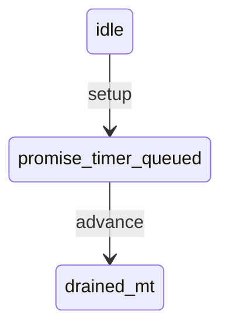
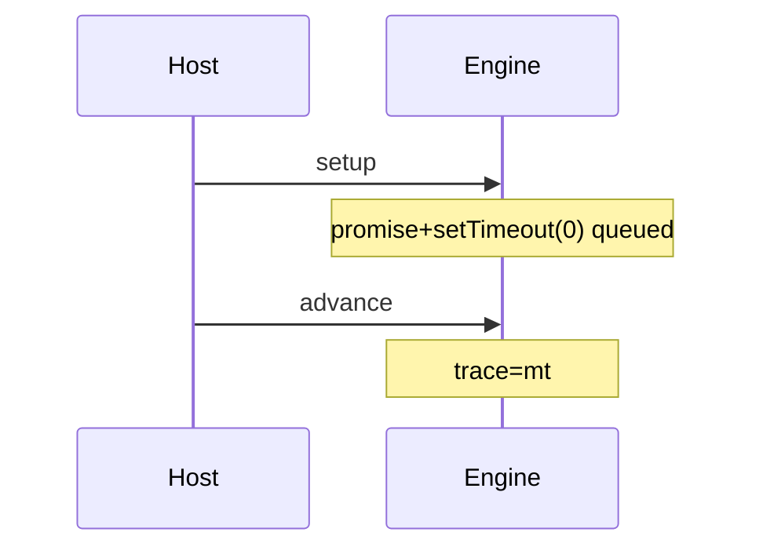

# Engine microtask before timer (state_tcas Observation)

```mermaid
stateDiagram-v2
    idle --> promise_timer_queued: setup
    promise_timer_queued --> drained_mt: advance
```

```mermaid
sequenceDiagram
    participant Host
    participant Engine
    Host->>Engine: setup
    Note over Engine: promise+setTimeout(0) queued
    Host->>Engine: advance
    Note over Engine: trace=mt
```
