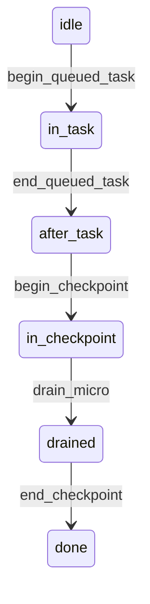
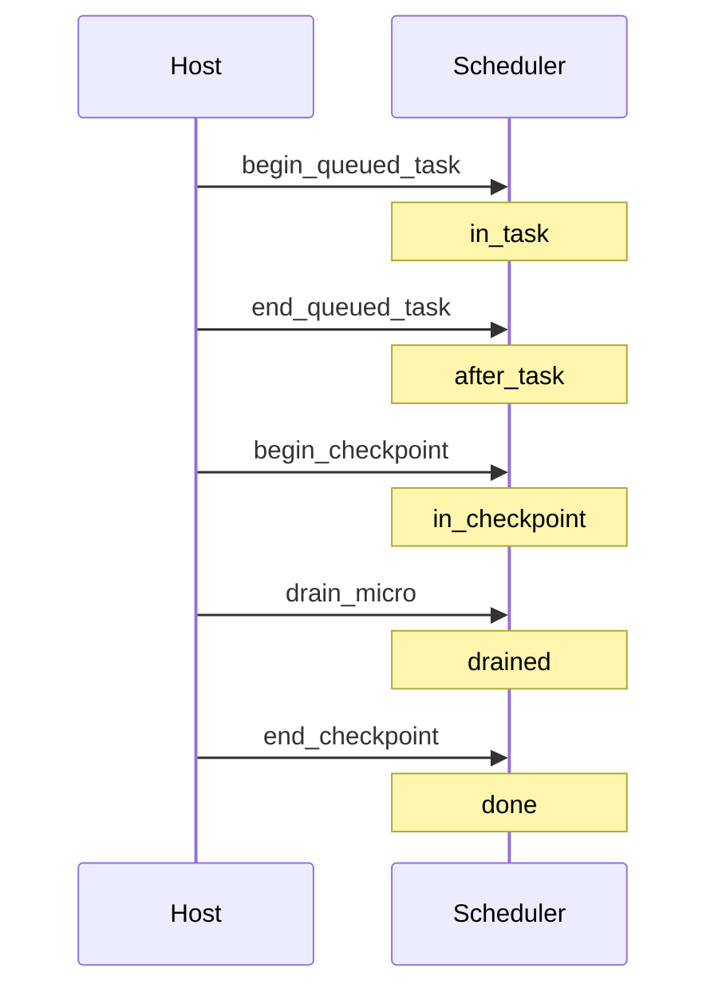

# Scheduler task then checkpoint (state_tcas Observation)

```mermaid
stateDiagram-v2
    after_task --> in_checkpoint: begin_checkpoint
    drained --> done: end_checkpoint
    idle --> in_task: begin_queued_task
    in_checkpoint --> drained: drain_micro
    in_task --> after_task: end_queued_task
```

```mermaid
sequenceDiagram
    participant Host
    participant Scheduler
    Host->>Scheduler: begin_queued_task
    Note over Scheduler: in_task
    Host->>Scheduler: end_queued_task
    Note over Scheduler: after_task
    Host->>Scheduler: begin_checkpoint
    Note over Scheduler: in_checkpoint
    Host->>Scheduler: drain_micro
    Note over Scheduler: drained
    Host->>Scheduler: end_checkpoint
    Note over Scheduler: done
```
